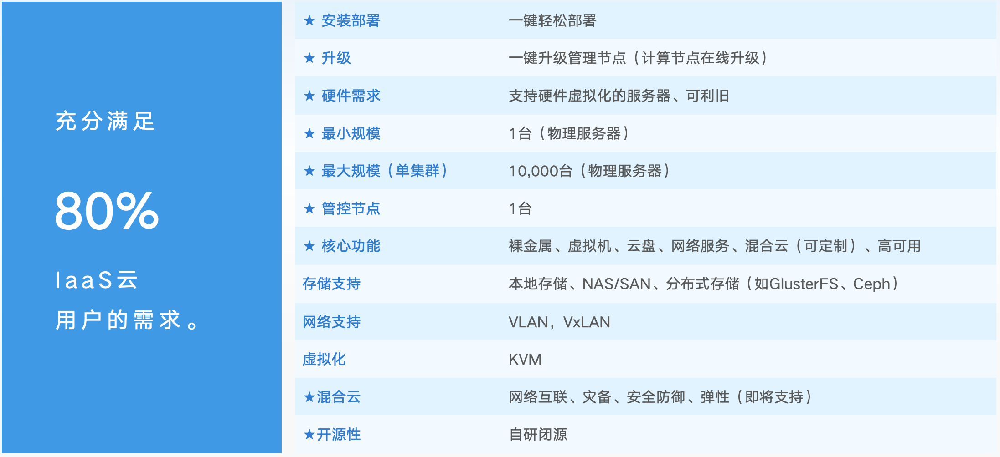

# 🌐 NextStack

## 📌 项目简介

**NextStack** 是一款 **新一代云计算 IaaS（基础设施即服务）平台**，专注于智能数据中心的构建与管理。它提供了灵活的 API 和高效的计算、存储、网络资源调度能力，支持 **裸金属计算、虚拟机管理**，以及 **分布式存储**，帮助企业快速搭建私有云、公有云或混合云环境。

NextStack 采用**微服务架构**，具备**轻量化、可扩展性、高可用、兼容国产硬件**等特点，致力于成为企业级 IT 基础设施的首选解决方案。

### 🚀 **极致轻量化**

- **最小 10MB 运行程序**，可在计算资源受限环境（如 IoT、边缘计算）中使用
- 低资源消耗，适用于 **轻量级私有云和本地部署**

### 🔗 **GPU直通**

- 支持虚拟机直通物理机GPU

### ⚡ **弹性计算**

- 提供 **虚拟机、裸金属服务器、容器** 统一管理
- 支持 **虚拟机热迁移**，保证业务连续性
- 动态资源调度，按需扩容计算能力

### 📡 **多种网络模式**

- 支持 **VLAN/VXLAN网络架构**
- 内置 **防火墙、安全组、NAT、负载均衡**
- 支持 **虚拟私有云（VPC）**

### 💾 **强大存储支持**

- **本地存储、NFS 存储、分布式存储（GlusterFS、Ceph）**
- **快照备份** 和 **弹性块存储**，保证数据高可靠性

### 📊 **智能监控与运维**

- **RESTful API、CLI、Web 控制台** 提供全方位管理
- **实时资源监控、告警系统、自动化任务调度**
- **Prometheus + Grafana 监控方案支持**




---

## 🧩 部署准备

### ⚠️ 注意事项（Notes）

在使用本项目/文档/脚本前，请注意以下事项：

- **环境依赖** ：请确保已安装所需的运行环境和依赖库。
- **网络要求**： 请确保已按照文档规划好指定网络。
- **部署参数配置**：请确保在执行脚本时已按照文档将必填参数配好。
- **系统环境** ：确保操作系统为纯净的Ubuntu22.04以上的操作系统。
- **错误处理** ：遇到异常请查看日志信息，默认Agent日志在/opt/gnext/log 下。
- **集群部署标准**：若进行集群化部署或接入Lnjoying云管平台，请仔细阅读[NextStack集群部署指南](./NextStack集群部署指南.md)。
- **持续更新** ：本文档/项目将持续更新，请关注最新版本。
- **存储位置**：默认存储位置为/vms。
- **镜像库位置**：默认镜像存放位置在/vms/backing下，目前镜像仅支持Ubuntu20.04，如需更多系统镜像请联系技术支持。
- **平台预置镜像**：平台目前预置Ubuntu20.04，并预装以下驱动组件：

| 预装软件          | 版本号          |
| ---------------- | -------------- |
| **GPU Driver**   | 550.78    |
| **CUDA**         | 12.4 |
| **CUDNN**        | 9.1.1      |

- **存储池**：推荐接入自有存储，不建议使用NFS共享存储。

### 核心组件

| 组件                     | 功能                                                  |
| ------------------------ | ----------------------------------------------------- |
| **Nextstack Cloud**      | 集群控制中心，负责全局资源调度、API 接入、状态同步    |
| **Gnext Agent**          | 各个计算节点，执行实际资源操作（如创建 VM、挂载卷等） |
| **ETCD Cluster**         | 数据库，用于保存集群状态、配置信息                    |
| **Open vSwitch (OVS)**   | 提供 VLAN/VXLAN 网络虚拟化能力                        |
| **Prometheus + Grafana** | 监控方案，提供实时性能监控                            |

### 系统要求

| 类型               | 最低要求                      |
| ------------------ | ----------------------------- |
| 操作系统           | Ubuntu 22.04+                 |
| CPU 架构           | x86_64                        |
| Python 版本        | 3.9+                          |
| 内存（每节点）     | ≥ 64GB                        |
| 存储空间（系统盘） | ≥ 512GB SSD                   |
| NTP                | 所有节点互通，时间同步（NTP） |
| 存储池（可选）     | 可选单独接入已有存储池        |
| 交换机             | 推荐型号H3C S6800系列         |
| 网卡               | 10Gbps * 3 ，分别用于NextStack的管理网络/南北向网络/东西向网络 |

---

## 🚀 快速开始（Getting Started）

此指南仅为单机版本，若进行集群化部署或接入Lnjoying云管平台，请仔细阅读[NextStack集群部署指南](./NextStack集群部署指南.md)

### 开始前环境准备

部署平台前，请确定系统是否安装pip依赖，可通过以下命令来判断是否已安装：

```bash
# Ubuntu
pip3 --version
```

如依赖未安装，请使用以下命令进行安装：

```bash
# Ubuntu
sudo apt install -y python3-pip
```

安装sshpass 、arping等必要依赖软件

```bash
# Ubuntu
sudo apt install -y sshpass
sudo apt install -y arping
```


### 步骤 1：克隆代码到本地

下载安装所需文件

```bash
git clone git@codehub.devcloud.huaweicloud.com:79576738980b48eda79db6408798aa83/open-nextstack.git

#切换至install目录
cd open-nextstack/install
```

### 步骤 2：配置参数

修改config.yml文件，配置参数如下所示：

```bash
# Ubuntu
sudo vim config.deploy.allinone.yml
```

配置文件示例如下（**请注意：此配置文件中所有内容均为必填项**）：

```bash
#config配置文件示例
gnext_src: /root/dev-gnext
linux_dist: ubuntu
exporter: True

nodes:
- host: 192.168.8.114
  user: root
  passwd: lnjoying
  etcd:
    etcd_name: etcd-single

# 业务节点
- host: 192.168.8.114
  user: root
  passwd: lnjoying
  gnext:
    agent_ip: 192.168.8.114
    agent_port: 8899
    log_level: debug
    default_eip: 192.168.8.192
    wan_gw_ip: 192.168.8.1
    vlan_range: 301-4000
    wan_gw_mac: C0:B8:E6:ED:4D:1F
    lan_nic: eno6
    wan_nic: eno7
    # 对于单节点模式，使用单个etcd endpoint
    etcd_endpoints:
      - http://localhost:2379
    # 对于集群模式，使用多个etcd endpoints
    # etcd_endpoints: 
    #   - http://192.168.8.111:2379
    #   - http://192.168.8.112:2379
    #   - http://192.168.8.113:2379
  manager: True
```

配置文件说明（必配置项）

| 参数           | 描述                                                         |
| -------------- | :----------------------------------------------------------- |
| nextstack_src  | 部署脚本所在的位置的绝对路径，可使用 pwd 命令查看当前脚本所在位置      |
| linux_dist     | 部署机器所在的系统类型 ，ubuntu或centos                      |
| host           | Gnext Agent节点的可通信IP，可通过ip -br a查看                |
| user           | Gnext Agnet节点的 SSH 登录用户名，该用户必须为 **root** 用户或其他具有 **sudo** 命令执行权限的用户 |
| passwd         | Gnext Agent的 SSH 登录密码                      |
| manager         | Nextstack中的云端管理平面参数，该参数为True时则在该节点安装云端管理平面，False则不安装 |
| agent_ip       | Gnext Agent的 节点IP，正常情况下可与host共用，如需区分，可使用 ip -br a查看 |
| lan_nic        | Gnext Agent中东西向网络工作网卡，由ovs服务接管，需要独立于管理网络之外，确保无其他服务使用当前网卡，可通过ip -br a查看空余网卡 |
| wan_nic        | Gnext Agent中南北向网络工作网卡，由ovs服务接管，需要独立于管理网络之外，确保无其他服务使用当前网卡，可通过ip -br a查看空余网卡 |
| vlan_range     | Gnext Agent中vlan的规划范围，默认即可                |
| wan_gw_ip      | Gnext Agent中 wan口网卡的出口网关地址，一般为上层交换机地址，通常可通过ip route show命令查看wan网卡出口默认网关地址，请注意：如果wan口网卡没有配置ip ，请先通过 ip a a [IP地址/子网掩码] dev [网卡设备名称]  命令配置临时ip，最后在进行获取默认网关操作 |
| default_eip    | Gnext Agent中默认的出口eip，通常是出口网络内没有被占用的空闲IP，此参数需要根据实情况填写，机器侧无法直接获取,请注意：EIP为Nextstack中虚拟机出外网所用到的IP，若填写错误或ip无法出外网，将无法为vm提供外网服务 |
| wan_gw_mac     | Gnext Agent中 wan口网卡的出口网关地址的MAC地址，在已经获取到wan_gw_ip参数后，通过arping -I [网关IP地址] 获取网关mac地址, 如果wan_nic没有配置ip，请先通过 ip a a [IP地址/子网掩码] dev [网卡设备名称]  命令配置临时ip |
| etcd_endpoints | Gnext Agent中ETCD数据库的连接参数，单机中一般无需更改配置，lcoalhost即可 |
| exporter | Gnext Agent中安装监控组件选项：True/False |
| etcd_name | Gnext Agent中ETCD数据库的节点名称 |

### 步骤 3：安装依赖

```bash
# 使用pip安装依赖，注意：运行命令需要pip3.9+版本
# 若不确定全局pip版本，请使用以下命令确认：
pip3 --version
#若pip版本为3.9+，请使用以下命令:
pip3 install -r requirements.txt
# 若pip版本低于3.9版本，则通过强指定pip3.9版本使用以下命令：
pip3.9 install -r requirements.txt
```

### 步骤 4：启动部署脚本

```bash
# 启动安装部署脚本，并制定配置文件 ，注意：运行命令需要python3.9+版本
# 若不确定全局python版本，请使用以下命令确认：
python --version
#若python版本为3.9+，请使用以下命令:
python3 gnext_deploy.py  -C config.deploy.allinone.yml
# 若python版本低于3.9版本，则通过强指定python3.9版本使用以下命令：
python3.9 gnext_deploy.py  -C config.deploy.allinone.yml

```


### 步骤 5：检查服务状态

检查ETCD数据库状态：

```bash
systemctl status lnjoying-etcd
```

检查gnext服务状态：

```bash
systemctl status lnjoying-gnext
```

检查vnc服务状态：

```bash
systemctl status lnjoying-novnc
```

---

## 修改Agent配置

### 步骤 1：停止服务

```bash
systemctl stop lnjoying-gnext
```

### 步骤 2：修改配置文件

```bash
cd /opt/gnext
vim config.yml
```

### 步骤 3：重启服务

```bash
systemctl restart lnjoying-gnext
```

---

## 📊 使用 Web 控制台

使用浏览器访问任意节点的 Web 控制台：

```bash
http://<controller-ip>
```

默认账户：

- 用户名：admin
- 密码：Lnjoying2023!

---

## 📦使用 CLI 进行管理

```bash
gnext --help
Gnext is both a CLI and an agent of the GNext cloud management system.

Usage:
  gnext [flags]
  gnext [command]

Available Commands:
  agent       Agent management
  cp          VM checkpoint management
  gpu         VM management
  help        Help about any command
  host        Host management
  img         Img management
  nfs         NFS management
  pool        Pool management
  port        Port management
  service     Service management
  sg          SG management
  snap        Volume snapshot management
  subnet      Subnet management
  vm          VM management
  vol         Vol management
  vpc         VPC management

Flags:
  -h, --help          help for gnext
      --host string   set the host of the gnext service (default "192.168.8.138")
      --port uint32   set the port of the gnext service (default 8899)
  -V, --version       show version

Use "gnext [command] --help" for more information about a command.
```

### gnext CLI示例

```bash
#查看agent节点
gnext agent list --host string 
```

```bash
#查看gpu数量
gnext gpu list --host string 
```

```bash
#查看具体gpu信息
gnext gpu get -U uuid --host string 
```

```bash
#查看vm数量
gnext vm list --host string 
```

```bash
#查看vm信息
gnext vm get -U uuid --host string 
```

```bash
#查看vpc数量
gnext vpc list --host string 
```

```bash
#查看vpc信息
gnext vpc get -U uuid --host string 
```

📌 **完整 CLI 文档**：[NextStack CLI Guide](https://your-cli-guide-link)

---

## 📈 监控与日志

NextStack 集群支持以下监控方式：

- Prometheus + Grafana 实时监控
- 告警通知（Email/Webhook）

---

## 🧪 常见问题（FAQ）

### Q：如何升级集群版本？

A：建议采用滚动升级策略，逐个节点更新二进制文件并重启服务。

### Q： 如何查看镜像库位置？

A： 默认位置为： /vms/backing，可通过以下命令查看

```bash
ls /vms/backing
```

### Q: gnext在安装完毕后报错，缺失libpcap.so.1文件

A：可先进行库的安装，之后进行软连接即可

```
apt install -y libpcap-dev
ln -s /usr/lib/x86_64-linux-gnu/libpcap.so.0 /usr/lib/x86_64-linux-gnu/libpcap.so.1
```


### Q： 如何修改管理员登录密码

A:   可通过访问Nextstack WebUI页面进行修改,如下图所示：

第一步：进入控制台后，点击右上角用户名-修改密码
第二步：根据提示更改密码，点击确定后即可完成密码修改
第三步：重新登录

### Q： 需要更多技术支持

技术支持群联系方式：

---

## 🤝 贡献指南（Contributing）

我们欢迎社区开发者贡献代码，改进 NextStack！

### 贡献方式

1. **Fork 本项目**
2. **创建新分支** (`git checkout -b feature-xyz`)
3. **提交代码** (`git commit -m "Add feature xyz"`)
4. **推送到远程仓库** (`git push origin feature-xyz`)
5. **创建 PR（Pull Request）**，等待审核

📌 **详细贡献指南**：[Contributing Guide](https://your-contribution-guide)

### 我们需要你的帮助！

- 🛠 **修复 Bug**
- 🚀 **新增功能**
- 📖 **完善文档**
- 💡 **分享使用案例**

---

## 📜 许可证（License）

NextStack 采用 **Apache 2.0 开源协议**，详情请查看 [LICENSE](LICENSE) 文件。