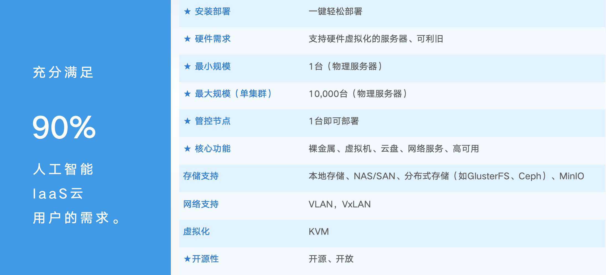

# 🌐 NextStack

English | [简体中文](README_CN.md)

## 📌 Project Overview

**NextStack** is a **next‑generation IaaS (Infrastructure‑as‑a‑Service) platform** designed for modern intelligent data centers. It provides flexible APIs and efficient scheduling for compute, storage, and network resources, supporting **bare‑metal compute, virtual machines**, and **distributed storage** so you can quickly build private, public, or hybrid cloud environments.

NextStack adopts a **microservices architecture** and is **lightweight, scalable, highly available, and compatible with mainstream & domestic hardware**. Our goal is to become the preferred foundation for enterprise‑grade IT infrastructure.

### 🚀 Ultra‑lightweight by Design

- Minimal runtime size of **~10 MB**
- Can run in resource‑constrained environments such as IoT and edge nodes
- Low overhead, suitable for **lightweight private clouds and on‑prem deployments**

### 🔗 GPU Passthrough

- Supports direct passthrough of physical GPUs into virtual machines

### ⚡ Elastic Compute

- Unified management for **virtual machines, bare‑metal servers, and containers**
- **Live migration** support to keep workloads online during maintenance
- Dynamic resource scheduling to scale compute capacity on demand

### 📡 Rich Networking Models

- Supports **VLAN/VXLAN‑based network architectures**
- Built‑in **firewall, security groups, NAT, and load balancing**
- Supports **Virtual Private Cloud (VPC)**

### 💾 Powerful Storage Capabilities

- Supports **local storage, NFS, and distributed storage (GlusterFS, Ceph)**
- **Snapshots** and **elastic block storage** for high data reliability

### 📊 Monitoring & Operations

- Full‑stack management via **RESTful APIs, CLI, and Web console**
- **Real‑time resource monitoring, alerting, and automated job scheduling**
- Native support for **Prometheus + Grafana** monitoring stack




---

## 🧩 Before You Start

### ⚠️ Important Notes

Before using this project / documentation / scripts, please keep the following in mind:

- **Runtime dependencies**: Make sure all required system packages and libraries are installed.
- **Network planning**: Ensure that your network layout matches the design described in the documentation.
- **Deployment parameters**: Confirm that all required parameters have been properly configured before running any scripts.
- **OS environment**: A clean **Ubuntu 22.04 or later** environment is required.
- **Error handling**: When errors occur, check the logs first. By default, the Agent logs are under: `/opt/gnext/log`.
- **Cluster deployment**: For clustered deployments or for integrating with the Lnjoying cloud management platform, please read the **NextStack Cluster Deployment Guide** (`NextStack集群部署指南.md`) carefully.
- **Continuous updates**: This project and documentation are continuously updated. Please always refer to the latest version in this repository.
- **Default storage location**: VM data is stored under `/vms` by default.
- **Image repository path**: VM images are stored under `/vms/backing` by default. Currently only **Ubuntu 20.04** images are pre‑validated. For additional OS images, please contact technical support.
- **Pre‑built platform image**: The platform currently ships with a pre‑built **Ubuntu 20.04** VM image with the following GPU stack:

| Preinstalled Software | Version   |
| --------------------- | --------- |
| **GPU Driver**        | 550.78    |
| **CUDA**              | 12.4      |
| **cuDNN**             | 9.1.1     |

- **Storage pool**: It is recommended to connect your own storage system. NFS shared storage is **not** recommended for production.

### Core Components

| Component               | Description                                                                 |
| ----------------------- | --------------------------------------------------------------------------- |
| **NextStack Cloud**     | Cluster control plane, responsible for global resource scheduling, APIs, and state sync |
| **Gnext Agent**         | Runs on each compute node and performs real operations (create VMs, attach volumes, etc.) |
| **ETCD Cluster**        | Key‑value store used to persist cluster state and configuration            |
| **Open vSwitch (OVS)**  | Provides VLAN/VXLAN‑based network virtualization                           |
| **Prometheus + Grafana**| Monitoring stack for real‑time metrics and dashboards                      |

### System Requirements

| Item                | Minimum Requirement                          |
| ------------------- | ---------------------------------------------|
| Operating System    | Ubuntu 22.04+                                |
| CPU Architecture    | x86_64                                       |
| Python Version      | 3.9+                                         |
| Memory (per node)   | ≥ 64 GB                                      |
| System Disk         | ≥ 512 GB SSD                                 |
| NTP                 | All nodes must be time‑synchronized (NTP)    |
| Storage Pool (opt.) | Optional external storage pool               |
| Switch              | Recommended: H3C S6800 series                |
| NICs                | 3 × 10 Gbps NICs for: management / north‑south / east‑west traffic |

---

## 🚀 Quick Start (Single‑Node)

This quick start guide covers **single‑node** deployment only. For clustered deployments or integration with the Lnjoying cloud management platform, please refer to the **NextStack Cluster Deployment Guide** (`NextStack集群部署指南.md`).

### Environment Preparation

Before deployment, verify that `pip` is available:

```bash
# Ubuntu
pip3 --version
```

If `pip` is not installed, install it with:

```bash
# Ubuntu
sudo apt install -y python3-pip
```

Install required tools like `sshpass` and `arping`:

```bash
# Ubuntu
sudo apt install -y sshpass
sudo apt install -y arping
```

### Step 1: Clone the Repository

Download the project:

```bash
git clone git@github.com:lnjoying-ai/open-nextstack.git

# Switch to the install directory
cd open-nextstack/install
```

### Step 2: Configure Deployment Parameters

Edit the config file, for example:

```bash
sudo vim config.deploy.allinone.yml
```

Sample configuration (**all fields are required**):

```bash
# Configuration example
gnext_src: /root/dev-gnext
linux_dist: ubuntu
exporter: True

nodes:
- host: 192.168.8.114
  user: root
  passwd: lnjoying
  etcd:
    etcd_name: etcd-single

# Business node
- host: 192.168.8.114
  user: root
  passwd: lnjoying
  gnext:
    agent_ip: 192.168.8.114
    agent_port: 8899
    log_level: debug
    default_eip: 192.168.8.192
    wan_gw_ip: 192.168.8.1
    vlan_range: 301-4000
    wan_gw_mac: C0:B8:E6:ED:4D:1F
    lan_nic: eno6
    wan_nic: eno7
    # For single‑node mode, use a single etcd endpoint
    etcd_endpoints:
      - http://localhost:2379
    # For cluster mode, use multiple etcd endpoints
    # etcd_endpoints: 
    #   - http://192.168.8.111:2379
    #   - http://192.168.8.112:2379
    #   - http://192.168.8.113:2379
  manager: True
```

Configuration field reference (required items):

| Parameter       | Description                                                                 |
| --------------- | --------------------------------------------------------------------------- |
| `nextstack_src` | Absolute path to the deployment scripts. You can run `pwd` in the script directory to get it. |
| `linux_dist`    | OS type of the deployment machine, e.g. `ubuntu` or `centos`.              |
| `host`          | Reachable IP of the Gnext Agent node. Run `ip -br a` to check.            |
| `user`          | SSH username for the Gnext Agent node. Must be **root** or a user with **sudo** privileges. |
| `passwd`        | SSH password for the Gnext Agent node.                                     |
| `manager`       | Whether to install the NextStack cloud control plane on this node (`True`/`False`). |
| `agent_ip`      | Node IP of the Gnext Agent. Usually the same as `host`. Use `ip -br a` to confirm. |
| `lan_nic`       | NIC used for east‑west traffic, taken over by OVS. Must be dedicated and not used by other services. |
| `wan_nic`       | NIC used for north‑south traffic, taken over by OVS. Must be dedicated and not used by other services. |
| `vlan_range`    | VLAN ID range used by the Gnext Agent. Default values are usually fine.    |
| `wan_gw_ip`     | Gateway IP for the WAN NIC. Typically the upstream switch IP. Use `ip route show` to check the default gateway. If the WAN NIC has no IP, assign a temporary IP with `ip a a [IP/CIDR] dev [iface]` first. |
| `default_eip`   | Default EIP used by VMs for outbound Internet access. Must be a free IP in the external network segment. If set incorrectly, VMs will not be able to reach the Internet. |
| `wan_gw_mac`    | MAC address of the WAN gateway. Once `wan_gw_ip` is known, use `arping -I [iface] [gateway-ip]` to obtain the MAC. If WAN NIC has no IP, assign a temporary IP as above. |
| `etcd_endpoints`| ETCD connection endpoints. For single‑node deployments, `localhost` is sufficient. |
| `exporter`      | Whether to install monitoring exporters on the Gnext Agent (`True`/`False`). |
| `etcd_name`     | Node name for the ETCD instance.                                           |

### Step 3: Install Python Dependencies

```bash
# Install Python dependencies with pip (requires pip 3.9+)
# Check global pip version first:
pip3 --version

# If pip is 3.9+:
pip3 install -r requirements.txt

# If global pip is < 3.9, explicitly use pip3.9:
pip3.9 install -r requirements.txt
```

### Step 4: Run the Deployment Script

```bash
# Run the deployment script with the specified config file (requires Python 3.9+)
# Check Python version:
python --version

# If Python is 3.9+:
python3 gnext_deploy.py -C config.deploy.allinone.yml

# If global Python is < 3.9, explicitly use python3.9:
python3.9 gnext_deploy.py -C config.deploy.allinone.yml
```

### Step 5: Verify Services

Check ETCD status:

```bash
systemctl status lnjoying-etcd
```

Check `gnext` service status:

```bash
systemctl status lnjoying-gnext
```

Check VNC service status:

```bash
systemctl status lnjoying-novnc
```

---

## 🔧 Updating Agent Configuration

### Step 1: Stop the Service

```bash
systemctl stop lnjoying-gnext
```

### Step 2: Edit the Config File

```bash
cd /opt/gnext
vim config.yml
```

### Step 3: Restart the Service

```bash
systemctl restart lnjoying-gnext
```

---

## 📊 Web Console

Access the Web console from any node via:

```bash
http://<controller-ip>
```

Default credentials:

- Username: `admin`
- Password: `Lnjoying2023!`

> ⚠️ For security reasons, **please change the default password immediately after first login.**

---

## 📦 CLI Usage

```bash
gnext --help
Gnext is both a CLI and an agent of the GNext cloud management system.

Usage:
  gnext [flags]
  gnext [command]

Available Commands:
  agent       Agent management
  cp          VM checkpoint management
  gpu         VM management
  help        Help about any command
  host        Host management
  img         Img management
  nfs         NFS management
  pool        Pool management
  port        Port management
  service     Service management
  sg          SG management
  snap        Volume snapshot management
  subnet      Subnet management
  vm          VM management
  vol         Vol management
  vpc         VPC management

Flags:
  -h, --help          help for gnext
      --host string   set the host of the gnext service (default "192.168.8.138")
      --port uint32   set the port of the gnext service (default 8899)
  -V, --version       show version

Use "gnext [command] --help" for more information about a command.
```

### CLI Examples

```bash
# List agent nodes
gnext agent list --host <host-ip>
```

```bash
# List GPUs
gnext gpu list --host <host-ip>
```

```bash
# Get details of a specific GPU
gnext gpu get -U <uuid> --host <host-ip>
```

```bash
# List VMs
gnext vm list --host <host-ip>
```

```bash
# Get details of a specific VM
gnext vm get -U <uuid> --host <host-ip>
```

```bash
# List VPCs
gnext vpc list --host <host-ip>
```

```bash
# Get details of a specific VPC
gnext vpc get -U <uuid> --host <host-ip>
```

---

## 📈 Monitoring & Logs

NextStack clusters support:

- Real‑time monitoring with **Prometheus + Grafana**
- Alert notifications (Email / Webhook)

Agent logs:

- Default path: `/opt/gnext/log`

---

## 🧪 FAQ

### Q: How do I upgrade the cluster?

A: We recommend a **rolling upgrade** strategy: update binaries node‑by‑node and restart related services to avoid downtime.

---

### Q: Where is the image repository located?

A: By default, images are stored under:

```bash
/vms/backing
```

You can verify with:

```bash
ls /vms/backing
```

---

### Q: `gnext` reports a missing `libpcap.so.1` after installation. What should I do?

A: Install the dependency and create a symlink:

```bash
apt install -y libpcap-dev
ln -s /usr/lib/x86_64-linux-gnu/libpcap.so.0 /usr/lib/x86_64-linux-gnu/libpcap.so.1
```

---

### Q: How can I change the admin login password?

A: Log into the NextStack Web UI and:

1. Click your username in the top‑right corner → **Change Password**.
2. Follow the prompts to set a new password.
3. Log in again with the new credentials.

---

### Q: How can I get further technical support?

A: Please contact: `service@lnjoying.com`.

---

## 🤝 Contributing

We warmly welcome community contributions to improve NextStack!

### How to Contribute

1. **Fork** this repository.
2. **Create a feature branch**: `git checkout -b feature-xyz`
3. **Commit your changes**: `git commit -m "Add feature xyz"`
4. **Push to your fork**: `git push origin feature-xyz`
5. **Open a Pull Request** and wait for review.

Please make sure your code follows the existing style and includes necessary tests and documentation updates where appropriate.

---

## 📜 License

The community edition of this project is provided under an **Apache 2.0–style open-source license with additional terms for commercial use**.
Please see the [LICENSE](LICENSE) file for the full license text.

---

## 📣 Contact

- Website: [https://91gpu.cloud](https://91gpu.cloud)
- Email: `service@lnjoying.com`
- Community: WeChat group (add friend): `lnjoying-ai`

If you are deploying AiCloud in production or would like to discuss partnership opportunities, feel free to reach out.